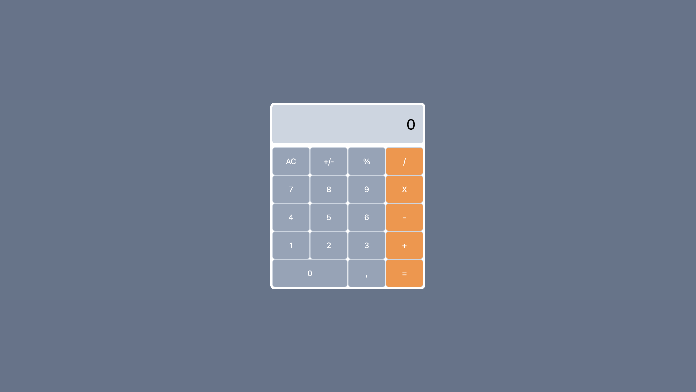

# Simple Calculator

A simple calculator project, developed to perform operations such as addition, subtraction, multiplication and division, with a modern and intuitive design.

Ideal for those looking for practicality in quick calculations, with an attractive look!

## 📚 Technologies

This project was developed with the following technologies:

- ⚡️ ReactJS
- 🎨 Tailwind

## 💻 Project

The Calculator was created to facilitate the performance of basic calculations, being a useful and practical tool. It has a user-friendly interface and is fully functional to perform mathematical operations quickly and easily!

## 🎨 Layout

The layout was developed in a responsive way to ensure a great experience on mobile devices and desktops. You can check out the live preview by clicking the link below:

[🔗 Access the live project](https://snoorky.github.io/calculator)
